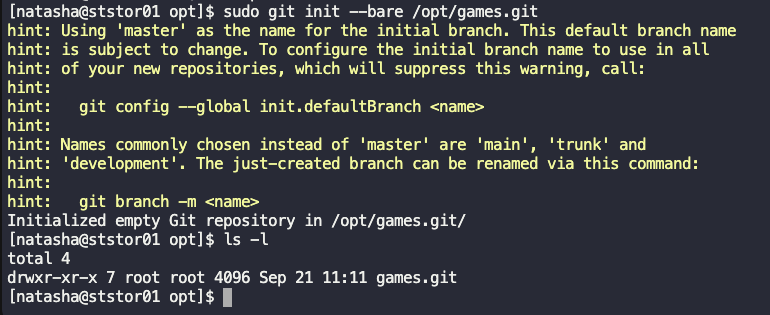

# Solution

1. ssh into the Nautilus Storage Server 
    ```
    ssh natasha@172.16.238.15
    ```
2. Update the package manager's cache
    ```
    sudo yum update
    ```
3. Install git 
    ```
    sudo yum install git
    ```
4. Verify git installation
    ```
    git --version
    ```
5. Change directory to /opt
    ```
    cd /opt
    ```
6. Create the bare repository using the **git init** command with the **--bare** flag
    ```
    sudo git init --bare /opt/games.git
    ```
7. Verify that the bare repository was created
    ```
    ls -l
    ```

      
