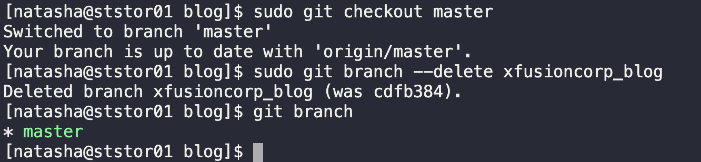

# Solution

1. Change directory
    ```
    cd /usr/src/kodekloudrepos/blog
    ```
2. Verify branch
    ```
    git brnach
    git config --global --add safe.directory /usr/src/kodekloudrepos/blog
    ```
3. Change branch to master
    ```
    sudo git checkout master
    ```
4. Delete xfusioncorp_blog branch
    ```
    sudo git branch --delete xfusioncorp_blog
    ```

    